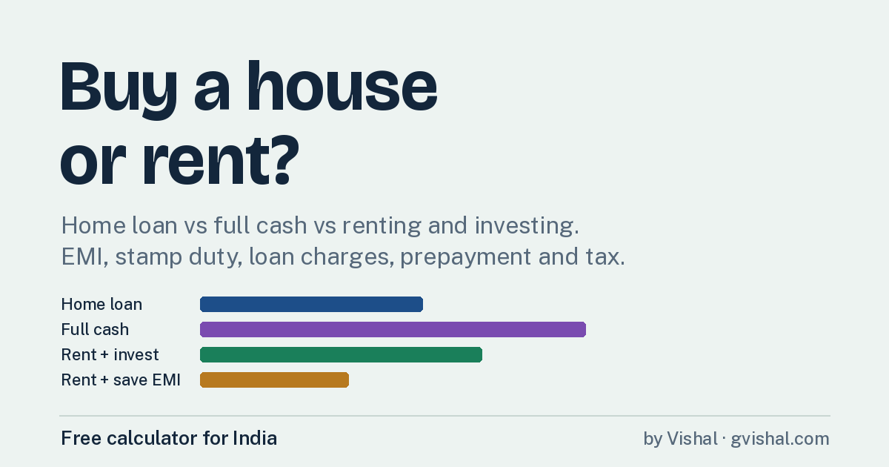

# Rent vs Buy Calculator (India)

### 👉 [Open the calculator](https://YOUR-USERNAME.github.io/YOUR-REPO/)

Compare buying a house on a home loan, paying full cash, or renting and investing.
Includes EMI, stamp duty, loan charges, prepayment savings and income tax (old vs new regime).

Developed by [Vishal](https://www.gvishal.com/)
